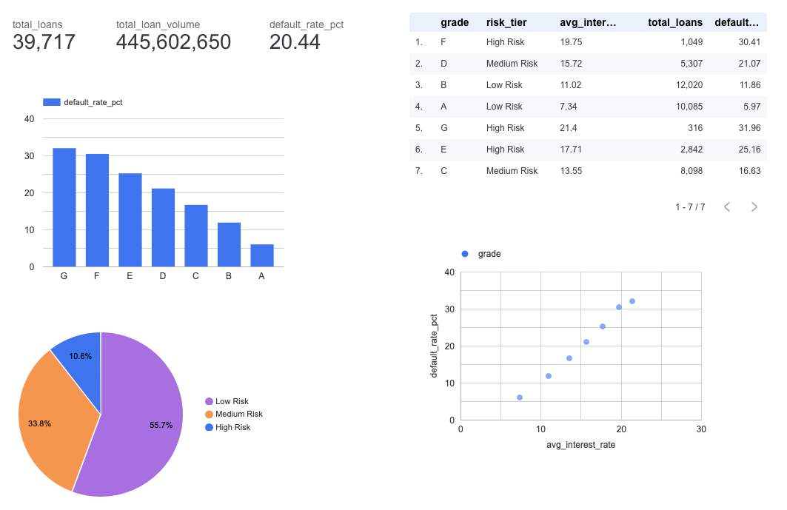

# Lending Portfolio Risk Intelligence Platform

> **DE Zoomcamp 2026 — Final Project**
> **Author:** Daniel Jude | ML Engineer Intern — Credit Risk & Decisioning, 10mg Health (Birmingham, UK)

---

## Live Dashboard

**Click to open:** https://lookerstudio.google.com/reporting/d7e1e22a-fcb2-445f-a9f1-b0f5e3122685



---

## What This Project Does

This project builds a **fully automated, end-to-end credit risk data pipeline** using the public Lending Club loan dataset (2007–2011). It ingests raw loan data, transforms it through multiple layers, streams it in real-time, analyses it with distributed computing, and visualises the results in a live dashboard.

**The core business question this platform answers:**
> Which loan grades carry the most risk, and how does that risk translate into interest rates and default rates?

**Without this pipeline**, credit analysts spend hours every week manually downloading CSVs, running Excel formulas, and producing reports that are already stale by the time they reach the credit committee.

**With this pipeline**, risk teams get live portfolio insights automatically — default rates, DPD buckets, delinquency signals — all updated and ready in a dashboard.

---

## Key Findings

| Metric | Value |
|--------|-------|
| Total loans analysed | 39,717 |
| Total loan volume | $445,602,650 |
| Average default rate | 20.44% |
| Grade A default rate | 5.97% — lowest risk |
| Grade G default rate | 31.96% — highest risk |
| Low Risk portfolio share | 55.7% of all loans |
| Delinquency rate (streaming) | 39.1% of streamed loans |

---

## Architecture

```
┌─────────────────────────────────────────────────────────────────┐
│                    DATA SOURCE                                   │
│        Kaggle Lending Club CSV (2.26M rows, 2007–2011)          │
└────────────────────────┬────────────────────────────────────────┘
                         │
                         ▼
┌─────────────────────────────────────────────────────────────────┐
│              INFRASTRUCTURE (Terraform)                          │
│   GCS Bucket + 4 BigQuery Datasets + Partitioned Table          │
└────────────────────────┬────────────────────────────────────────┘
                         │
                         ▼
┌─────────────────────────────────────────────────────────────────┐
│              ORCHESTRATION (Kestra)                              │
│   Flow 1: Ingest CSV → GCS → BigQuery (MERGE, idempotent)       │
│   Flow 2: Scheduled daily trigger                               │
│   Flow 3: Run dbt transformations (Docker container)            │
└────────────┬───────────────────────────┬────────────────────────┘
             │                           │
             ▼                           ▼
┌────────────────────────┐  ┌────────────────────────────────────┐
│  STREAMING             │  │  BATCH TRANSFORMATION (dbt)        │
│  Redpanda (Kafka)      │  │  stg_loans  (view)                 │
│  PyFlink windows       │  │  fct_loans  (table)                │
│  PostgreSQL sink       │  │  mart_loan_risk  (table)           │
└────────────────────────┘  └──────────────┬─────────────────────┘
                                           │
                                           ▼
                         ┌─────────────────────────────────────┐
                         │   BATCH PROCESSING (PySpark)        │
                         │   4 queries: default rate, volume,  │
                         │   DPD buckets, risk tier summary    │
                         └──────────────┬──────────────────────┘
                                        │
                                        ▼
                         ┌─────────────────────────────────────┐
                         │   DASHBOARD (Looker Studio)         │
                         │   7 tiles — live BigQuery connection│
                         └─────────────────────────────────────┘
```

---

## Technologies Used

| Category | Technology | Purpose |
|----------|-----------|---------|
| Infrastructure as Code | Terraform | Create GCS bucket + BigQuery datasets automatically |
| Cloud Storage | Google Cloud Storage (GCS) | Store raw parquet files |
| Data Warehouse | Google BigQuery | Store, partition, cluster and query transformed data |
| Orchestration | Kestra | Schedule and automate all pipeline flows |
| Batch Transformation | dbt (data build tool) | 3-layer data transformation + 5 quality tests |
| Streaming Broker | Redpanda (Kafka-compatible) | Real-time loan event streaming |
| Stream Processing | Apache Flink + PyFlink | Tumbling window + session window jobs |
| Batch Processing | Apache Spark (PySpark) | Distributed batch analysis (DataFrame + RDD API) |
| Visualisation | Looker Studio | Live dashboard connected directly to BigQuery |
| Environment | uv | Python environment + dependency management |
| Language | Python 3.13 | All scripts and jobs |
| Cloud | Google Cloud Platform (GCP) | All cloud infrastructure |

---

## Dataset

| Field | Details |
|-------|---------|
| Name | Lending Club Loan Data |
| Source | Kaggle (public dataset) |
| Period | 2007–2011 |
| Rows used | 39,717 (filtered subset) |
| Full dataset | 2.26 million rows |
| Key columns | grade, loan_amnt, int_rate, loan_status, mths_since_last_delinq |

The dataset contains real anonymised loan records from Lending Club — a US peer-to-peer lending platform. Each row is one loan with a grade (A = safest, G = riskiest), amount, interest rate, and repayment status.

---

## Project Structure

```
08 project/
├── Makefile                    # One-command shortcuts (make spark, make dbt-run etc.)
├── README.md                   # This file
├── PRD.md                      # Full project requirements document
├── BUILD_JOURNAL.md            # Step-by-step build log (beginner friendly)
├── pyproject.toml              # uv Python environment
├── docs/
│   └── dashboard_screenshot.png
├── terraform/                  # Infrastructure as code
│   ├── main.tf
│   ├── variables.tf
│   └── outputs.tf
├── kestra/                     # Orchestration flows
│   ├── docker-compose.yml
│   └── flows/
│       ├── 01_ingest_lending_club.yaml
│       ├── 02_schedule_ingest.yaml
│       └── 03_run_dbt.yaml
├── dbt/lending_club/           # Data transformation
│   ├── models/
│   │   ├── staging/            # stg_loans (view — cleaned data)
│   │   ├── core/               # fct_loans (table — enriched data)
│   │   └── mart/               # mart_loan_risk (table — dashboard data)
│   └── profiles.yml
├── streaming/                  # Real-time processing
│   ├── docker-compose.yml
│   ├── Dockerfile.flink
│   ├── producer_loans.py
│   ├── consumer_delinquency.py
│   └── src/job/
│       ├── q4_tumbling_grade.py
│       └── q5_session_window.py
├── spark/                      # Batch processing
│   └── credit_risk_analysis.py
└── credentials/                # GCP service account key (git-ignored)
```

---

## Quick Start (Using Makefile)

```bash
# See all available commands
make help

# 1. Provision GCP infrastructure
make infra

# 2. Start Kestra orchestration
make ingest

# 3. Run dbt transformations
make dbt-run

# 4. Run dbt tests
make dbt-test

# 5. Run Spark batch analysis
make spark

# 6. Start streaming pipeline
make stream

# 7. Stop everything
make teardown
```

---

## How to Reproduce This Project (Step by Step)

### Prerequisites

- Google Cloud account with billing enabled
- GitHub Codespaces or Linux/Mac environment
- Docker + Docker Compose installed
- `uv` installed: `pip install uv`
- Terraform installed
- `gcloud` CLI installed and authenticated

---

### Step 1 — Clone the repo and set up Python environment

```bash
git clone https://github.com/YOUR_USERNAME/lending-portfolio-risk-pipeline.git
cd "lending-portfolio-risk-pipeline/08 project"

# Install all Python dependencies
uv sync
```

---

### Step 2 — Configure GCP credentials

```bash
# Create credentials folder
mkdir -p credentials

# Place your GCP service account JSON key at:
# credentials/gcp-service-account.json

# Copy the example env file and fill in your values
cp .env.example .env
# Open .env and set: GCP_PROJECT_ID, GCP_LOCATION, GCS_BUCKET
```

---

### Step 3 — Create GCP infrastructure with Terraform

```bash
cd terraform
cp terraform.tfvars.example terraform.tfvars
# Edit terraform.tfvars — set your GCP project ID

terraform init
terraform plan
terraform apply
cd ..
```

This creates: GCS bucket, 4 BigQuery datasets (`lending_club_raw`, `lending_club_staging`, `lending_club_core`, `lending_club_mart`), and a partitioned + clustered `loans_raw` table.

---

### Step 4 — Start Kestra and run ingestion

```bash
cd kestra
docker compose up -d
```

Open Kestra UI at `http://localhost:8080`

1. Go to **KV Store** → add these keys:
   - `GCP_PROJECT_ID` → your project ID
   - `GCP_LOCATION` → `EU` (or your region)
   - `GCS_BUCKET` → `YOUR_PROJECT_ID-lending-club-raw`
   - `GCP_BIGQUERY_DATASET` → `lending_club_raw`
   - `GOOGLE_APPLICATION_CREDENTIALS_JSON` → paste your full service account JSON

2. Go to **Flows** → run `01_ingest_lending_club` → downloads CSV, uploads to GCS, loads BigQuery

3. Run `03_run_dbt` → transforms data: staging → core → mart

---

### Step 5 — Run dbt manually (optional)

```bash
cd "08 project"
export GOOGLE_APPLICATION_CREDENTIALS="credentials/gcp-service-account.json"
export GCP_PROJECT_ID=$(grep ^GCP_PROJECT_ID .env | cut -d= -f2)

uv run dbt run --project-dir dbt/lending_club --profiles-dir dbt/lending_club
uv run dbt test --project-dir dbt/lending_club --profiles-dir dbt/lending_club
```

---

### Step 6 — Run Spark batch analysis

```bash
cd "08 project"

# IMPORTANT: Java 21 required — Java 25 (codespace default) breaks Spark
export JAVA_HOME=/usr/local/sdkman/candidates/java/21.0.9-ms
export PATH=$JAVA_HOME/bin:$PATH
export GOOGLE_APPLICATION_CREDENTIALS="credentials/gcp-service-account.json"
export GCP_PROJECT_ID=$(grep ^GCP_PROJECT_ID .env | cut -d= -f2)

uv run spark/credit_risk_analysis.py
# Results saved to spark/output/
```

---

### Step 7 — Run Streaming pipeline (optional)

```bash
cd streaming
docker compose up -d --build

# Terminal 1 — send 5,000 loan events to Redpanda
cd "08 project" && uv run streaming/producer_loans.py

# Terminal 2 — consume events and count delinquencies
cd "08 project" && uv run streaming/consumer_delinquency.py
# Press Ctrl+C to see the final delinquency summary
```

---

### Step 8 — View the Dashboard

Open the live dashboard:
https://lookerstudio.google.com/reporting/d7e1e22a-fcb2-445f-a9f1-b0f5e3122685

Or build your own by connecting Looker Studio to `lending_club_mart.mart_loan_risk` in BigQuery.

---

## Data Model (dbt 3-layer architecture)

```
lending_club_raw.loans_raw
    Raw ingested data — partitioned by ingest_ts, clustered by grade
         │
         ▼
lending_club_staging.stg_loans   (VIEW — always fresh, zero storage)
    Cleaned: int_rate % sign removed, risk_tier column added
         │
         ▼
lending_club_core.fct_loans      (TABLE — pre-computed for speed)
    Enriched: is_defaulted flag, repayment_rate_pct calculated
         │
         ▼
lending_club_mart.mart_loan_risk (TABLE — 7 rows, one per grade)
    Final summary: default rates, volumes, averages by grade
    ← This is what the Looker Studio dashboard reads
```

---

## dbt Data Quality Tests

| Test | Column | Status |
|------|--------|--------|
| not_null | loan_id | ✅ Passed |
| not_null | grade | ✅ Passed |
| accepted_values (A,B,C,D,E,F,G) | grade | ✅ Passed |
| not_null | loan_status | ✅ Passed |
| not_null | loan_amount | ✅ Passed |

---

## Course Modules Demonstrated

| Module | Technology | How it is used in this project |
|--------|-----------|-------------------------------|
| Module 1 | Docker, Terraform | All infrastructure provisioned as code — no manual cloud clicks |
| Module 2 | Kestra | 3 automated flows: ingest, schedule, dbt run |
| Module 3 | BigQuery | Partitioned + clustered warehouse table |
| Module 4 | dbt | 3-layer transformation with tests and documentation |
| Module 5 | PySpark | 4 batch analyses using DataFrame API and RDD API |
| Module 6 | Redpanda + PyFlink | Streaming producer, consumer, tumbling and session windows |

---

## Important Notes for Reproduction

- **Credentials:** All secrets are git-ignored. You must supply your own GCP service account JSON.
- **Java version:** Spark requires Java 17 or 21. The codespace default (Java 25) will fail — always export `JAVA_HOME` before running Spark.
- **dbt profiles:** Two profiles exist — `dev` (for running from terminal) and `kestra` (for running inside Docker).
- **Kestra KV Store:** All GCP credentials are stored in Kestra's KV Store — nothing is hardcoded in the flows.
- **Idempotent pipeline:** The Kestra ingestion uses MD5 deduplication — safe to re-run without creating duplicate rows.

---

> **Academic Integrity:** This is original work built for the DE Zoomcamp 2026 final project submission. It uses the publicly available Lending Club dataset from Kaggle. All code written from scratch. Not submitted to any other course or bootcamp.
